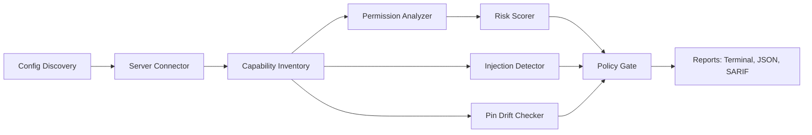

# MCPAudit Implementation Roadmap

This file tracks the current implementation state and the safest next expansion
path. It is intentionally evidence-based: if a capability is listed as current,
it exists in the codebase and has test coverage.

## Current State

MCPAudit is a local-first MCP permission auditor. It discovers configured MCP
servers, optionally connects to them, inventories capabilities, classifies tool
permission risk, detects prompt-injection patterns, checks tool schema drift,
and emits terminal, JSON, and SARIF reports.

Current scan behavior:

1. Discover MCP configs for Claude Desktop, Claude Code, Cursor, VS Code, and
   Windsurf, plus an optional explicit config path.
2. For connected scans, initialize each server over stdio or HTTP/SSE and list
   tools, prompts, and resources when supported.
3. For `--skip-connect`, avoid spawning or contacting servers and infer
   conservative risk from local config declarations only.
4. Classify tool permissions across `file_read`, `file_write`, `network`,
   `shell_execution`, `destructive`, and `exfiltration`.
5. Optionally run prompt-injection checks over tool, prompt, and resource text.
6. Optionally compare current tool schemas against the pin baseline.
7. Optionally evaluate a local YAML policy gate and exit `2` after reports are
   written when the gate fails.

## Implemented Capabilities

- Config discovery and parsing for the supported MCP clients.
- Guarded stdio/HTTP connection lifecycle with timeout cleanup.
- Config-only risk inference for `scan --skip-connect`.
- Tool inventory, annotation coverage, and permission classification.
- Prompt and resource inventory for connected scans, including first-pass
  permission findings for prompt arguments and resource URI schemes.
- Prompt and resource injection detection when `--inject-check` is enabled.
- Stable finding metadata with rule IDs, severity, description, and remediation.
- Prompt-injection detection with stable metadata and SARIF output.
- Consistent tool, prompt, and resource target metadata in JSON/SARIF findings.
- Documented JSON/SARIF output contract with compatibility fixture coverage.
- Tool schema pinning and drift checks with changed-field hints and suggested
  actions.
- Pin baseline status summaries through `pin --status`, including server
  counts, tool counts, pin ages, and JSON output.
- Shared redaction for terminal, JSON, SARIF, and connection-error output.
- Local policy gates through `scan --policy`, including global and per-server
  enforcement rules.
- Adoption, pin maintenance, prompt/resource scoring boundary, beta readiness,
  stable readiness, scoring migration, beta-feedback, and security-review docs
  for beta users.
- Watch, monitor, and MCP server entrypoints.
- Optional LLM-assisted classification behind `--llm-analysis`.

## Architecture



Core modules:

- `src/mcp_audit/cli.py`: Click commands and scan orchestration.
- `src/mcp_audit/discovery/`: MCP client config discovery and parsing.
- `src/mcp_audit/connector.py`: MCP connection lifecycle and capability listing.
- `src/mcp_audit/analyzer.py`: deterministic permission inference.
- `src/mcp_audit/injection.py`: deterministic prompt-injection pattern checks.
- `src/mcp_audit/pinning.py`: pin storage and drift detection.
- `src/mcp_audit/policy.py`: local YAML policy gate evaluation.
- `src/mcp_audit/report.py`: terminal and JSON report rendering.
- `src/mcp_audit/sarif.py`: SARIF 2.1.0 export.

## Trust Boundaries

- MCPAudit must not store, log, or transmit credential values.
- MCPAudit must not mutate MCP client config files during scans.
- `discover` and `scan --skip-connect` are the safest config-only inspection
  paths.
- Default connected scans may spawn stdio MCP servers or contact configured HTTP
  endpoints to enumerate live metadata.
- `mcp-audit pin` intentionally connects to servers because useful pins require
  live tool schemas.
- Optional LLM analysis is opt-in and requires an API key.

## Next Expansion Priorities

### 1. Prompt And Resource Risk Analysis

Prompt/resource permission findings and injection detection are now present.
Useful follow-ups:

- decide whether selected prompt/resource findings should contribute to the
  server composite risk score.
- add more real-world resource-template fixtures from popular MCP servers.

The current scoring decision is documented in `docs/PROMPT-RESOURCE-SCORING.md`:
prompt/resource findings stay visible and policy-gatable, but do not affect the
composite server score until a calibrated scoring model is proven.
The recommended migration path is documented in `docs/SCORING-MIGRATION.md`.

Current beta calibration covers risky prompt arguments, file resources, remote
resource schemes, templated resources, and benign cases.

Done when prompt/resource analysis has the same maturity as tool analysis and a
tested scoring migration is ready.

### 2. Policy Gate Depth

The policy gate supports severity thresholds, drift, denied permission
categories, max risk, required pin coverage, server allowlists, separate
finding thresholds, and per-server overrides. Useful follow-ups:

- richer sample policies for team-specific adoption.

Done when policies can express common adoption rules without custom scripting.

### 3. Pin Baseline Review UX

Drift findings now explain what changed, and `pin --status` now gives a
reviewable baseline summary. `pin --refresh <server>` now provides a dry-run
review for one server and requires `--apply` before replacing its pins.

Useful follow-ups:

- bulk stale-pin cleanup, if users need it after the explicit server-scoped
  workflows settle.

The supported maintenance path is documented in `docs/PIN-MAINTENANCE.md`.

Done when users can maintain pins without inspecting YAML by hand.

### 4. Output Contract Hardening

Reports now carry richer metadata, with a documented JSON/SARIF contract and a
representative compatibility fixture plus a golden output-contract snapshot.
Useful follow-ups:

- add more downstream consumer tests if external integrations start depending
  on the JSON shape.

Done when downstream CI users have copy-paste integration examples.

### 5. Beta Feedback Loop

The beta feedback issue template is present. Useful follow-ups:

- triage false-positive and false-negative reports into validation fixtures;
- promote recurring policy requests into examples or first-class gates;
- keep SARIF/JSON compatibility notes current as downstream users adopt them.

The workflow for converting feedback into fixtures is documented in
`docs/BETA-FEEDBACK-TO-FIXTURES.md`.

### 6. Release Readiness

Before the next public alpha/beta:

- recheck README, SECURITY, CHANGELOG, and this roadmap against live CLI help;
- run the canonical verifier from `.codex/verify.commands`;
- confirm GitHub Actions passes on the release branch;
- publish release notes that distinguish config-only scans from connected scans.
- follow `docs/RELEASE-CHECKLIST.md` for PyPI and clean-install smoke checks.
- use `docs/STABLE-READINESS.md` for the `1.0.0` stable go/no-go bar.

## Verification Contract

Routine verifier:

```bash
uv run pytest
uv run ruff check
uv run mypy src
```

Additional closeout checks used for PR work:

```bash
uv run ruff format --check
git diff --check
```

Known boundary: strict `uv run mypy .` still includes test-only typing debt and
is not the canonical green gate.
