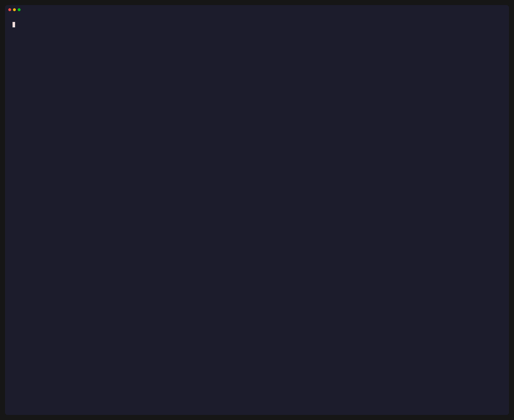
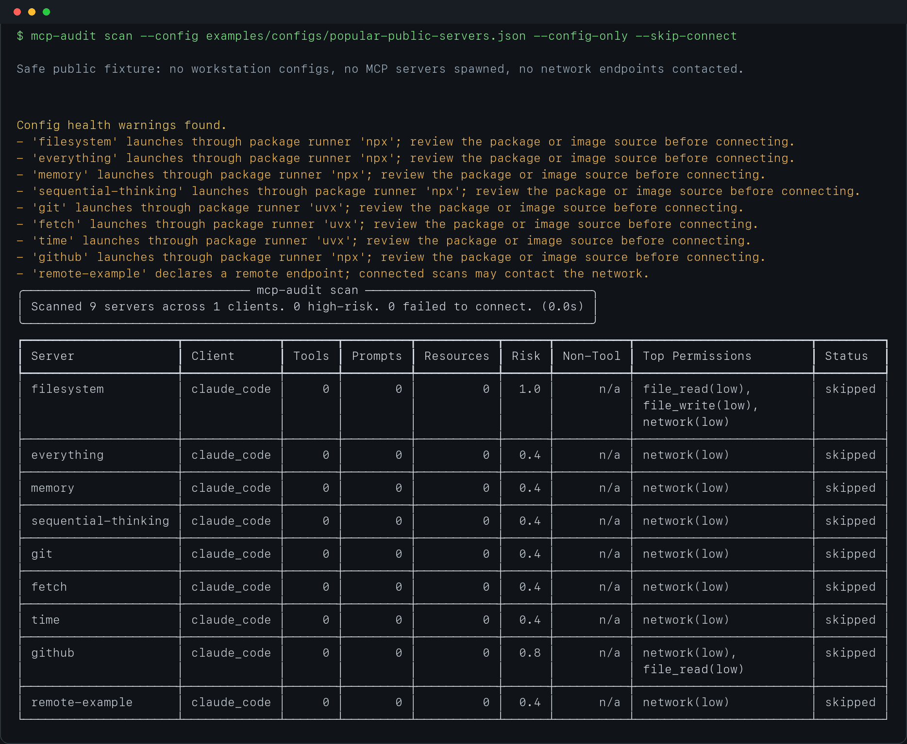
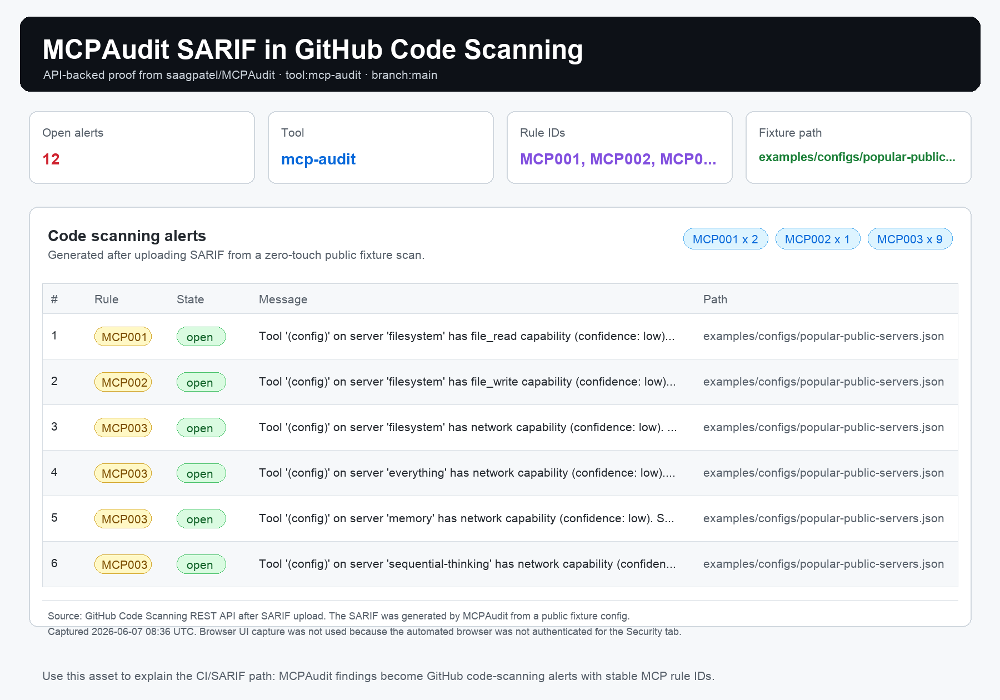
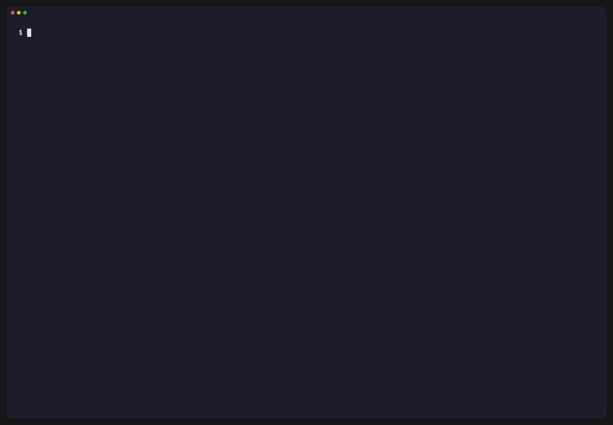
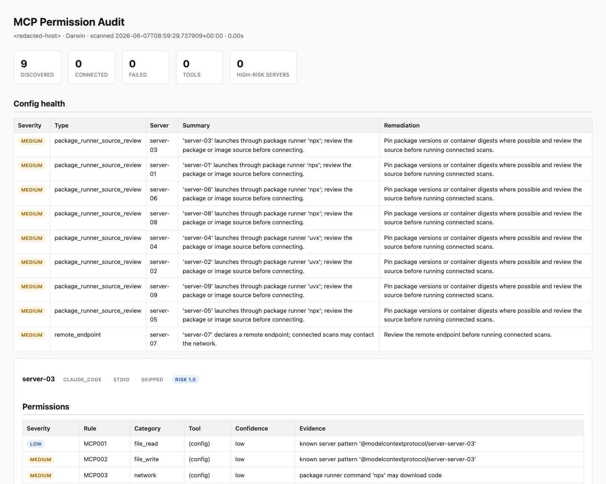

# mcp-audit

[](https://pypi.org/project/mcp-audits/)
[](https://pypi.org/project/mcp-audits/)
[](https://github.com/saagpatel/MCPAudit/actions/workflows/ci.yml)
[](https://github.com/saagpatel/MCPAudit/actions/workflows/codeql.yml)
[](LICENSE)

> ### Audit what your AI agents can actually touch.

Every MCP server wired into your editor is a process that can read your files, reach the network, or run shell commands on your behalf — frequently launched from a remote `npx`/`uvx` package that can change underneath you. **`mcp-audit`** reads the MCP configs already on your machine and tells you what each server *can do*, how risky it is, whether its tool descriptions hide adversarial instructions, and whether anything changed since you last looked.

Read-only by default: it never edits a config and reports env-var **key names only** (never values). Use `--skip-connect` for a zero-touch config-only pass that does not spawn MCP servers or contact remote endpoints; connected scans, package verification, downloads, and LLM analysis make their extra reach explicit in the command.

> **🌐 Try it in your browser, no install:** paste any MCP client config at **[mcp-audit.saagarpatel.dev](https://mcp-audit.saagarpatel.dev)** for an instant config-only trust report. It runs this exact engine, never launches configured servers, never contacts configured endpoints, and stores nothing. The CLI below adds the connected deep checks (prompt-injection, SSRF, the lethal trifecta, schema drift, SARIF).

## ⚡ 60-second start

No install required — [`uv`](https://docs.astral.sh/uv/) runs it in a throwaway environment. This reads the MCP configs already on your machine, connects to each configured server to read its real tool schemas, and flags SSRF-shaped tools:

```bash
uvx --from mcp-audits mcp-audit scan --ssrf-check
```

It stays read-only the whole time — it never edits a config and reports env-var **key names only**, never values. Sample output:

```text
╭───────────────────── mcp-audit scan ─────────────────────╮
│ Scanned 5 servers across 2 clients. 1 high-risk.         │
│ 0 failed to connect. (2.4s)                              │
╰──────────────────────────────────────────────────────────╯
┏━━━━━━━━━━━━┳━━━━━━━━━━━━━━━━┳━━━━━━━┳━━━━━━━━━┳━━━━━━━━━━━┳━━━━━━┳━━━━━━━━━━┳━━━━━━━━━━━━━━━━━━━━━━━━━━━━┳━━━━━━━━━━━┓
┃ Server     ┃ Client         ┃ Tools ┃ Prompts ┃ Resources ┃ Risk ┃ Non-Tool ┃ Top Permissions            ┃ Status    ┃
┡━━━━━━━━━━━━╇━━━━━━━━━━━━━━━━╇━━━━━━━╇━━━━━━━━━╇━━━━━━━━━━━╇━━━━━━╇━━━━━━━━━━╇━━━━━━━━━━━━━━━━━━━━━━━━━━━━╇━━━━━━━━━━━┩
│ github     │ claude_desktop │    26 │       0 │         0 │  9.4 │ n/a      │ file_write, network, exfil │ connected │
│ filesystem │ claude_desktop │    12 │       0 │         0 │  6.8 │ n/a      │ file_write, file_read      │ connected │
│ memory     │ cursor         │     9 │       0 │         0 │  5.3 │ n/a      │ file_write                 │ connected │
│ fetch      │ cursor         │     1 │       0 │         0 │  3.5 │ n/a      │ network                    │ connected │
│ time       │ claude_desktop │     2 │       0 │         0 │  1.5 │ n/a      │ none                       │ connected │
└────────────┴────────────────┴───────┴─────────┴───────────┴──────┴──────────┴────────────────────────────┴───────────┘

──────────────────────────────── SSRF Warnings ────────────────────────────────
┏━━━━━━━━┳━━━━━━┳━━━━━━━━━┳━━━━━━━━━━┳━━━━━━━━━━━━━━━━━┳━━━━━━━━━━━━━━━━━━━┳━━━━━━━━━━━━━━━━━━━━━━┓
┃ Server ┃ Type ┃ Target  ┃ Severity ┃ Pattern         ┃ Evidence          ┃ Suggested Action     ┃
┡━━━━━━━━╇━━━━━━╇━━━━━━━━━╇━━━━━━━━━━╇━━━━━━━━━━━━━━━━━╇━━━━━━━━━━━━━━━━━━━╇━━━━━━━━━━━━━━━━━━━━━━┩
│ fetch  │ tool │ fetch   │ medium   │ url param +     │ url: string       │ Restrict to a host   │
│        │      │         │          │ fetch verb      │ (caller-supplied) │ allowlist; never     │
│        │      │         │          │ (MCP011)        │                   │ proxy caller URLs    │
└────────┴──────┴─────────┴──────────┴─────────────────┴───────────────────┴──────────────────────┘
```

> *Sample output with illustrative public server names. Higher risk = a broader surface to sandbox, **not** "malicious." Want a zero-touch pass first? Add `--skip-connect` to reason purely from your config — no servers spawned, no network calls. Stack `--trifecta-check` or `--shadow-check` alongside `--ssrf-check` to hunt more attack surfaces, and `--json` / `--sarif` / `--html` to pipe results into CI or a dashboard.*

Connected public-fixture demo (`fetch`, `sequential-thinking`, `time`; no auth tokens or workstation configs):



Zero-touch preview against the bundled public fixture:



Install it permanently once you're hooked:

```bash
uv tool install mcp-audits                # adds the `mcp-audit` command to your PATH
mcp-audit scan                            # connected scan of every configured client
```

**Drop it into CI in one step** — the composite GitHub Action runs the scan and writes SARIF straight to GitHub code scanning:

```yaml
- uses: saagpatel/MCPAudit@v2.2.1        # config-only by default; optional policy gate exits 2
```

SARIF proof from the public fixture scan:



Policy gate demo from the same zero-touch public fixture:



Self-contained HTML report preview from a redacted config-only scan:



PyPI package: [`mcp-audits`](https://pypi.org/project/mcp-audits/) · installed command: `mcp-audit` · full flag and detector reference below.

---

## Features

- **Capability inventory** — catalogs server tools, prompts, and resources; tool, prompt, and resource capabilities are classified across six permission categories: `file_read`, `file_write`, `network`, `shell_execution`, `destructive`, `exfiltration`
- **Config-only inference** — `scan --skip-connect` infers conservative risks from declared commands, transports, credential key names, package runners, and remote URLs
- **Config health diagnostics** — `discover` and `scan` flag duplicate server names, conflicting command or URL definitions, missing stdio commands, missing local command paths, project/global scope conflicts, package-runner launches, deprecated SSE transports, shell-wrapper launches, remote endpoints, and credential-heavy configs before users pin or connect; JSON reports include additive `config_health_findings`
- **Risk scoring** — composite 0–10 per server as a weighted sum of tool permission categories, with a five-dimension breakdown (file access, network, shell, destructive, exfiltration); prompt/resource findings also produce an additive `non_tool_risk` signal without changing `risk_score.composite`
- **Stable finding metadata** — permission and prompt-injection findings include stable rule IDs, severity, evidence, and suggested remediation so reports are easier to triage
- **Local policy gates** — `scan --policy policy.yaml` evaluates reports against local YAML rules and exits nonzero for CI enforcement
- **Report redaction** — terminal, JSON, SARIF, and HTML report paths share a redaction layer for likely credential values; `scan --redact` adds an opt-in field-report pass that also scrubs the machine hostname and home-path usernames (`/Users/<name>`, `/home/<name>`, `C:\Users\<name>`) from `--json`/`--sarif`/`--html` output, and replaces server names with stable aliases (`server-01`, …) everywhere they appear — structured fields, free-text summaries, and command basenames — so a config-only report is safe to share (the field-report checklist stays the backstop for any residual free-text specifics)
- **Prompt injection detection** — `scan --inject-check` scans tool, prompt, and resource text for instruction-override patterns, hidden directives, fake role turns, and adversarial phrasing; pattern-based, no LLM required
- **SSRF detection** — `scan --ssrf-check` flags tools and resources whose interface lets a caller steer a server-side request target (URL/host params paired with fetch verbs, caller-templated remote resource hosts); static and schema-derived, never issues a request or reads a credential value
- **Egress detection** — `scan --egress-check` audits *where* a server may send data: destinations outside `--egress-allowlist` (`MCP040`, MED), unbounded caller-controlled targets (`MCP041`, HIGH), and the trusted-destination residual for allowlisted-but-multi-tenant or credential-bearing hosts (`MCP042`, LOW/MED — the Cowork lesson). Static and schema/URI-derived; gated via `fail_on.egress`. See `docs/EGRESS-DETECTION.md`
- **Lethal trifecta detection** — `scan --trifecta-check` detects the canonical agent-exfiltration attack surface: per-server (HIGH, `MCP013`) when a single server covers all three legs (file_read + untrusted-content ingestion + exfiltration), and fleet-level advisory (MEDIUM, `MCP014`) when the trifecta assembles only across servers; re-uses inferred permissions, never issues requests or reads credentials
- **Tool-name shadowing detection** — `scan --shadow-check` flags cross-server tool-name collisions that could trick an AI agent into routing a call to the wrong server: exact matches (HIGH, `MCP015`), case/separator-normalised collisions (MEDIUM, `MCP016`), and homoglyph spoofing via non-ASCII confusable codepoints (HIGH, `MCP017`); offline, deterministic, no new dependencies
- **Schema drift tracking** — `mcp-audit pin` connects to servers and snapshots current tool schemas; subsequent `scan --pin-check` flags added, removed, and changed tools with plain-language summaries, changed-field hints, suggested actions, and a dry-run refresh workflow for reviewed upgrades. `pin --refresh <server>` additionally surfaces capability-escalation (`MCP018`/`MCP019`) and launch-config/provenance (`MCP020`–`MCP023`) deltas in the same preview — unconditionally, so a rug-pull or launch swap can't slip through a baseline refresh
- **Capability-escalation ("rug pull") detection** — `scan --escalation-check` compares each tool against its pin baseline and flags security-significant escalations over time: a tool that gained a dangerous capability (`MCP018` — HIGH for exfiltration/shell/destructive, MEDIUM for file_write/network) or whose description gained prompt-injection patterns (`MCP019`, HIGH); pure delta vs the approved baseline, so findings stay scoped to reviewed baseline deltas. See `docs/ESCALATION-DETECTION.md`
- **Provenance / launch-config drift detection** — `scan --provenance-check` compares a server's launch configuration against its pin baseline to catch supply-chain changes the schema check can't see: command/transport swap (`MCP020`, HIGH), argument/version drift with dangerous-flag escalation (`MCP021`, MED/HIGH), HTTP endpoint change (`MCP022`, HIGH), and credential **key-name** set changes (`MCP023`, MEDIUM — key names only, never values). See `docs/PROVENANCE-DETECTION.md`
- **Launch-artifact integrity detection** — `scan --integrity-check` hashes the on-disk artifact a server launches (the resolved command binary + local script args) and flags drift vs the pin baseline (`MCP024` — HIGH when the SHA-256 changed, MEDIUM when the file is gone). The command string can stay byte-identical while the file it runs is swapped underneath you; this catches that. Offline and deterministic — only local bytes are hashed, nothing is fetched. Package-runner (`npx`/`uvx`) launches hash the runner, not the remote package (see registry verification below). See `docs/INTEGRITY-DETECTION.md`
- **Registry package verification** — `scan --verify-artifacts` (opt-in, **network**) covers the package-runner case the on-disk check can't: it compares the registry-published hash (npm `dist.integrity`, PyPI sha256) for the exact pinned `package@version` against the hash captured at pin time (`MCP025` — HIGH on a changed published hash, a republish/tampering signal; MEDIUM when unverifiable). Network is contacted only under `--verify-artifacts`, on both `pin` (to capture) and `scan` (to compare). Covers npm + PyPI. See `docs/PACKAGE-VERIFICATION.md`
- **Byte-level artifact verification** — `scan --download-artifacts` (opt-in, **network**) goes one level deeper than the published-hash compare: it downloads the actual bytes the registry serves, hashes them, and checks them against both the registry's own published hash and a byte-hash captured at pin time (`MCP026`). It catches a CDN/mirror/MITM serving bytes inconsistent with the registry's integrity metadata (`PUBLISHED_MISMATCH`, HIGH) and a pinned file whose bytes changed or vanished (`BASELINE_MISMATCH`, HIGH); a newly-added file on a frozen version is an advisory MEDIUM, not a false alarm. Downloads stream through bounded hashers, never to disk, only to an allowlist of registry/CDN hosts (re-validated on every redirect hop). Network is contacted only under `--download-artifacts`, on both `pin` and `scan`.
- **Multi-client support** — reads configs from Claude Desktop, Claude Code, Cursor, VSCode, and Windsurf — plus custom paths via `--config`; use `--config-only` for isolated scans of one config file
- **Structured output** — Rich terminal report plus JSON and SARIF 2.1.0 export for ingestion by GitHub Advanced Security and SARIF-aware SAST pipelines, and a self-contained shareable HTML report via `scan --html report.html` (inline CSS, no JavaScript, redacted and fully HTML-escaped)
- **Drop-in CI distribution** — a composite GitHub Action (`uses: saagpatel/MCPAudit@v2.2.1`) runs the scan, writes SARIF, and uploads it to code scanning in one step (config-only by default; optional policy gate exits `2`); a `pre-commit` hook (`id: mcp-audit`) audits repo-local `.mcp.json` / `.vscode/mcp.json` on commit. See `docs/ADOPTION-GUIDE.md`
- **Documented output contract** — JSON, SARIF rule IDs, and policy exit codes are documented in `docs/OUTPUT-CONTRACT.md`
- **Watch mode** — `mcp-audit watch` re-scans on config file changes via `watchfiles` (optional extra: install with `mcp-audits[watch]`)

## Quick Start

### Prerequisites
- Python 3.11+
- `uv` (recommended) or `pip`

### Installation
```bash
uvx --from mcp-audits mcp-audit discover
# or install permanently:
uv tool install mcp-audits
# with watch mode support:
uv tool install 'mcp-audits[watch]'
# pip fallback:
pip install mcp-audits
```

### Usage
```bash
mcp-audit --version

# Discover configured MCP servers without connecting to them
mcp-audit discover

# Scan all configured MCP servers
mcp-audit scan

# Config-only scan that does not spawn or connect to servers
mcp-audit scan --skip-connect

# Filter to specific clients (comma-separated)
mcp-audit scan --clients claude_desktop,cursor

# Scan only one explicit MCP config file
mcp-audit scan --config ./mcp.json --config-only

# Check tools, prompts, and resources for prompt-injection patterns
mcp-audit scan --inject-check

# Flag SSRF-prone tools/resources (caller-controlled server-side fetch targets)
mcp-audit scan --ssrf-check

# Suppress SSRF findings whose fixed target host is trusted (caller-controlled targets are never suppressed)
mcp-audit scan --ssrf-check --ssrf-allowlist api.github.com,internal.svc

# Audit outbound destinations; hosts outside the allowlist are flagged, trusted multi-tenant hosts raise a residual
mcp-audit scan --egress-check --egress-allowlist api.anthropic.com,internal.corp.example

# Detect lethal-trifecta / toxic-flow attack surface (per-server and fleet-level)
mcp-audit scan --trifecta-check

# Detect cross-server tool-name shadowing (exact, normalised, homoglyph collisions)
mcp-audit scan --shadow-check

# Pin current tool schemas, then detect drift on later scans.
# Pinning connects to servers so it can capture real tool schemas.
mcp-audit pin
mcp-audit pin --status
mcp-audit pin --status --json
mcp-audit pin --stale
mcp-audit pin --stale --json
mcp-audit scan --pin-check

# Review expected drift for one server before refreshing its baseline.
mcp-audit pin --refresh github
mcp-audit pin --refresh github --json
mcp-audit pin --refresh github --apply

# Detect capability escalation ("rug pull") vs the pin baseline (implies a pin comparison).
# A tool that gained a dangerous capability, or a description that gained injection patterns.
mcp-audit scan --escalation-check

# Detect launch-config / provenance drift vs the pin baseline (command, args, URL, credential keys).
mcp-audit scan --provenance-check

# Detect on-disk launch-artifact (binary/script) hash drift vs the pin baseline.
mcp-audit scan --integrity-check

# Verify npm/PyPI package@version registry hashes vs the pin baseline (opt-in, network).
mcp-audit pin --verify-artifacts        # capture registry hashes into the baseline
mcp-audit scan --verify-artifacts       # compare on later scans

# Download the artifact bytes and verify their hash vs published + baseline (opt-in, network).
mcp-audit pin --download-artifacts      # capture byte-hashes into the baseline
mcp-audit scan --download-artifacts     # download + verify on later scans

# Export JSON or SARIF 2.1.0, or a single-file shareable HTML report
mcp-audit scan --json audit.json --sarif audit.sarif
mcp-audit scan --html audit.html

# Field-report mode: scrub hostname + home-path usernames from file output (opt-in)
mcp-audit scan --skip-connect --json field-report.json --redact

# Fail CI on local policy violations
mcp-audit scan --policy policy.yaml

# Optional LLM-assisted classification (requires ANTHROPIC_API_KEY)
mcp-audit scan --llm-analysis

# Watch mode — re-scan on config change; use --skip-connect for config-only watching
mcp-audit watch
```

## Help improve mcp-audit (2 minutes)

Redacted field reports from real MCP configs help calibrate the scanner.
If you run MCP servers, contributing one stays fully offline — no servers
spawned, no network:

```bash
python3 -m pip install --upgrade mcp-audits
mcp-audit --version
mcp-audit scan --skip-connect --json mcp-audit-field-report.json --redact
```

`--redact` auto-scrubs the machine hostname, home-path usernames, and server
names for you. Then open a [redacted field report](https://github.com/saagpatel/MCPAudit/issues/new?template=field_report.md)
— the template walks you through the safe fields. Please still redact credential
values and any proprietary prompt/tool/schema text; [`docs/EXTERNAL-FIELD-REPORT-REQUEST.md`](docs/EXTERNAL-FIELD-REPORT-REQUEST.md)
has the full checklist, and
[`docs/FIELD-REPORTS.md#minimal-public-example`](docs/FIELD-REPORTS.md#minimal-public-example)
shows a safe example shape. For a reference of what the scanner reports on real
software, see the solo field scan in
[`docs/FIELD-SCAN-POPULAR-SERVERS.md`](docs/FIELD-SCAN-POPULAR-SERVERS.md).
For an end-to-end generator-to-auditor demo packet, see
[`docs/MCP-TRUST-PACKET.md`](docs/MCP-TRUST-PACKET.md).

## Tech Stack

| Layer | Technology |
|-------|------------|
| Language | Python 3.11+ |
| CLI | Click 8 |
| Output | Rich |
| MCP protocol | `mcp` SDK 1.27+ |
| Validation | Pydantic v2 |
| Config parsing | PyYAML + json5 |
| Watch mode | `watchfiles` (optional extra) |
| Optional LLM | Anthropic SDK |

## Architecture

The scanner enumerates MCP client config files, connects to each configured server, and calls `tools/list`, `prompts/list`, and `resources/list` over the MCP protocol when those capabilities are available. Stdio servers are started as subprocesses via `anyio`; HTTP/SSE servers are contacted at their configured URL. Returned tool schemas, prompt arguments, and resource URIs flow into the permission classifier (schema walker + regex ruleset over six permission categories) and the optional injection detector (pattern ruleset for instruction-override, role-switch, and hidden-directive phrasing). The risk scorer composes a per-category weighted sum clamped to 0–10 from tool findings, then separately reports additive `non_tool_risk` for prompt and resource capability or injection findings. `non_tool_risk` is for triage and output consumers; it does not change `risk_score.composite`. Reports render via Rich; JSON and SARIF 2.1.0 export are first-class. The pin store serializes SHA256 schema hashes plus reviewable tool snapshots to `~/.mcp-audit-pins.yaml` for actionable drift detection on subsequent `--pin-check` scans. Use `mcp-audit pin --refresh <server>` to preview expected drift for one reviewed server — including capability-escalation and launch-config/provenance deltas vs the baseline — then rerun with `--apply` to replace that server's pins. Use `mcp-audit pin --stale` to review pinned servers that are no longer present in discovered MCP configs before clearing them explicitly with `mcp-audit pin --clear <server>`.

### Local Policy Gates

Policies are local YAML files evaluated after a scan. A failing policy exits with code `2` after terminal, JSON, or SARIF output is written.

```yaml
fail_on:
  severity: high
  injection: medium
  capabilities: medium
  config_health: medium
  drift: true
require:
  pins:
    servers:
      - github
deny:
  permissions:
    - shell_execution
max_risk: 7
allow_servers:
  - github
servers:
  github:
    max_risk: 5
    deny:
      permissions:
        - shell_execution
```

See `docs/ADOPTION-GUIDE.md` for local review, team CI, and GitHub code
scanning setup paths, `non_tool_risk` parsing examples, and policy selection
notes, and `examples/consumers/` for runnable JSON consumer examples. See `examples/policies/` for starter policies. See
`docs/GOLDEN-ROLLOUT.md` for the recommended config-only to policy-gated
rollout path. See `docs/STABLE-READINESS.md` for the stable-release bar. See
`docs/PIN-MAINTENANCE.md` for reviewed pin refresh and stale server cleanup
workflows. See `docs/PROMPT-RESOURCE-SCORING.md` and
`docs/SCORING-MIGRATION.md` for the current prompt/resource scoring boundary
and migration path. See `docs/COMPOSITE-SCORING-PROPOSAL.md` for the future
combined-score proposal. See `examples/ci/pin-stale-review.yml` and
`examples/maintenance/stale-pin-review.sh` for routine stale pin review flows.
See `docs/MAINTAINER-WORKFLOWS.md` for Codex-assisted maintainer workflows and
the boundaries used for security-sensitive triage and release preparation.
See `docs/FEEDBACK-TO-FIXTURES.md` for turning false positives, missing
detections, output issues, and pin lifecycle feedback into safe regression
fixtures. See `docs/FIELD-REPORTS.md` for the redacted field-report evidence
path, minimal public example shape, public field-report issue template, and
consumer-contract coverage. See
`docs/MCP-TRUST-PACKET.md` for the public MCP ecosystem demo path that pairs
mcpforge scaffolding with MCPAudit review output. See
`docs/SOLO-EVIDENCE.md` for solo multi-environment evidence that can reduce
release risk without replacing external reports. See
`docs/ROADMAP-NEXT.md` for the post-2.2.0 roadmap and
`docs/1.5-EVIDENCE-INTAKE.md` for the earlier adoption-hardening evidence
intake. See `docs/BETA-READINESS-EVIDENCE.md` for the beta-readiness evidence
and release decision. External field-report evidence is tracked in
<https://github.com/saagpatel/MCPAudit/milestone/4>. See
`docs/EXTERNAL-FIELD-REPORT-REQUEST.md` for the copy-paste contributor request,
and `docs/EXTERNAL-OUTREACH-MESSAGES.md` for direct outreach messages.

## License

MIT
