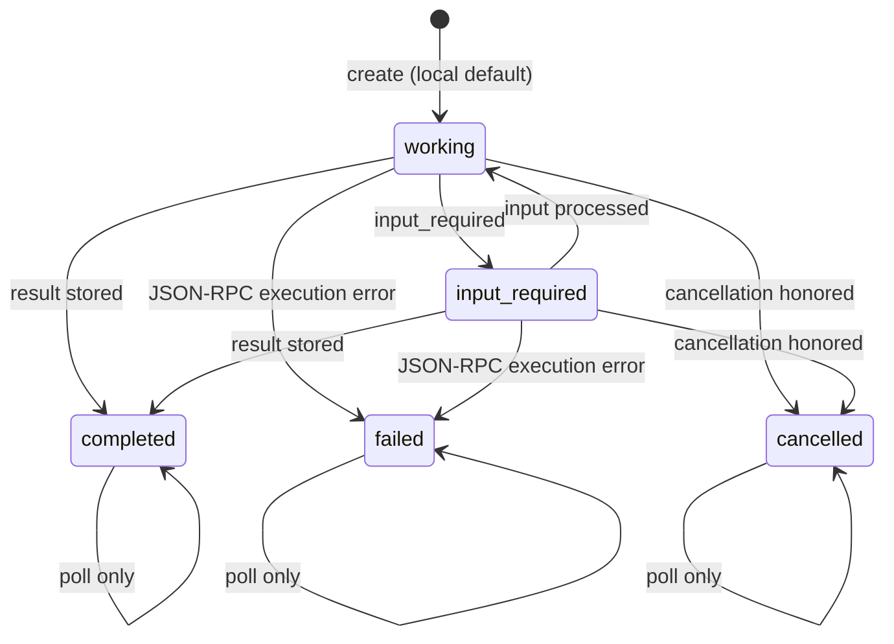

# MCP Task Time Machine

The MCP Task Time Machine is an offline, seed-free lifecycle laboratory for the
experimental MCP Tasks extension. It executes synthetic JSON scenarios against
a virtual clock, explains every event, and marks unsupported or ambiguous
behavior `UNKNOWN`. It never starts or contacts an MCP server.

## Five-minute demo

From a fresh clone:

```bash
uv sync --locked

# See the bundled scenarios.
uv run mcp-audit task-time-machine list

# Human-readable transition explanation.
uv run mcp-audit task-time-machine run --builtin happy-path

# Canonical machine-readable result; repeat for byte-identical output.
uv run mcp-audit task-time-machine run --builtin happy-path --json > /tmp/task-result-1.json
uv run mcp-audit task-time-machine run --builtin happy-path --json > /tmp/task-result-2.json
cmp /tmp/task-result-1.json /tmp/task-result-2.json

# Run a checked-in user-style fixture.
uv run mcp-audit task-time-machine run \
  tests/fixtures/task_time_machine/input-required.json --json

# Inspect the authoritative contracts.
uv run mcp-audit task-time-machine schema scenario
uv run mcp-audit task-time-machine schema result
```

Exit `0` means all supported invariants passed. Exit `1` means a supported
invariant failed or the result is `UNKNOWN`. Exit `2` means the CLI could not
open the requested input or the input selection was invalid. A failed task can
still produce simulator verdict `pass`: the verdict grades lifecycle evidence,
not whether the synthetic work succeeded.

Focused and full verification:

```bash
uv run pytest -q tests/test_task_time_machine.py
uv run pytest -q
uv run ruff check .
uv run mypy .
uv run ruff format --check
uv lock --check
git diff --check
uv run python tests/validation/validate_patterns.py
uv build --clear
```

## Standards pin and claim boundary

Research was refreshed on **2026-08-11** using official Model Context Protocol
sources only:

- [MCP Tasks overview](https://modelcontextprotocol.io/extensions/tasks/overview)
- [SEP-2663: Tasks Extension](https://tasks.extensions.modelcontextprotocol.io/seps/2663-tasks-extension)
- [`modelcontextprotocol/ext-tasks` revision `2c1425d`](https://github.com/modelcontextprotocol/ext-tasks/tree/2c1425d9a288b9b1f489430fe1e00bb392b47e48)
- [2026-07-28 release-candidate explanation](https://blog.modelcontextprotocol.io/posts/2026-07-28-release-candidate/)

The result contract records the full source revision and as-of date. The lab
targets protocol version `2026-07-28` plus extension identifier
`io.modelcontextprotocol/tasks`. Legacy `2025-11-25` Tasks are deliberately not
graded because SEP-2663 says the two designs are not wire-compatible.

The official surfaces do not present one simple maturity guarantee: SEP-2663
is `Final` on the Extensions Track, while the implementation repository and
overview still describe Tasks as experimental. MCPAudit therefore calls this
an **experimental extension profile** and makes no stability, adoption, SDK,
host-support, or interoperability claim.

## Lifecycle model



| Behavior | Authority in this lab | Handling |
|---|---|---|
| The server must durably create a task before returning its handle. | SEP-2663 `MUST` | Events before `create` fail `MCPTASK001`. |
| A created task is initially `working`. | Local fixture default | SEP-2663 says `working` is typical, not necessary; other initial states remain unsupported. |
| `tasks/get` returns the current status-specific shape. | SEP-2663 `MUST` | A stale local observation or an impossible future version fails `MCPTASK003`. |
| Clients honor `pollIntervalMs`. | SEP-2663 `SHOULD` | Too-early polling fails `MCPTASK003` with `protocol_should`. |
| `input_required` exposes task-lifetime-unique request keys. | SEP-2663 `MUST` | Reused keys fail `MCPTASK008`; update acknowledgement does not immediately force status. |
| Cancellation is acknowledged but cooperative and eventually consistent. | SEP-2663 `MUST`/`MAY` | `cancel_requested` does not change status; either completion or `cancel_applied` may win. |
| `completed`, `failed`, and `cancelled` never transition. | Design inference | Official overview calls them terminal, but SEP-2663 has no exhaustive normative matrix. Post-terminal mutations fail `MCPTASK002` and disclose the assumption. |
| After `ttlMs`, a task may fail, be deleted, or be treated unusable. | SEP-2663 `MAY`; underspecified choice | `expiry_policy` must be `mark_failed`, `delete`, or `unknown`; `unknown` emits `MCPTASK007`. Once `delete` is applied, every later observation or transition for that task ID is rejected as unavailable. |
| Retry/backoff and attempt exhaustion. | Local fixture policy | Deterministic integer exponential backoff; no claim that MCP requires this policy. |

`failed` is reserved for JSON-RPC execution errors. A tool result with
`isError: true` belongs in a `completed` task result under SEP-2663. P01 does
not inspect arbitrary result content; it records only whether a result or error
was present.

## Scenario contract

The strict identifier is `mcpaudit.task-time-machine.scenario.v1`. Unknown
fields, implicit coercions, duplicate JSON keys, duplicate sequence numbers,
events before `initial_clock_ms`, non-regular inputs, symlinks, and inputs over
1 MiB are rejected or become a structured `UNKNOWN` result. Strict JSON also
rejects non-finite numbers and bounds nesting to 32 levels and 20,000 nodes.

```json
{
  "schema_version": "mcpaudit.task-time-machine.scenario.v1",
  "scenario_id": "quick-demo",
  "description": "Completion wins a cooperative cancellation race.",
  "protocol_version": "2026-07-28",
  "spec_profile": "mcp-tasks-extension-sep-2663",
  "task_id": "task-quick-demo",
  "initial_clock_ms": 0,
  "ttl_ms": 60000,
  "poll_interval_ms": 1000,
  "retry_policy": {
    "max_attempts": 3,
    "initial_backoff_ms": 1000,
    "multiplier": 2,
    "max_backoff_ms": 8000
  },
  "expiry_policy": "unknown",
  "assumptions": [],
  "events": [
    {"event_id": "create", "sequence": 1, "at_ms": 0, "type": "create"},
    {"event_id": "cancel", "sequence": 2, "at_ms": 1000, "type": "cancel_requested"},
    {"event_id": "done", "sequence": 3, "at_ms": 1000, "type": "complete", "result": {"ok": true}}
  ]
}
```

Events are always executed by `(at_ms, sequence)`, independent of array order.
Sequences must be unique. Event IDs are normally unique, but the contract
allows reuse so duplicate-delivery behavior can be tested; later duplicates
are ignored and flagged `MCPTASK006`. No random seed, wall clock, duration,
hostname, platform, absolute path, or generated ID enters the result.

Supported event types:

- `create`, `work_started`, `poll`;
- `retryable_error`, `retry`;
- `input_required`, `input_submitted`, `resume_working`;
- `cancel_requested`, `cancel_applied`;
- `complete`, `fail`, `expire`.

## Result contract

The strict identifier is `mcpaudit.task-time-machine.result.v1`. JSON is compact,
key-sorted UTF-8 with one terminal newline. The result includes:

- a canonical scenario SHA-256, source pin, ordering rule, and explicit null seed;
- every transition with before/after status, disposition, authority, explanation,
  state version, attempt, and virtual time;
- stable `MCPTASK000`–`MCPTASK008` findings with requirement level and assumptions;
- final status and availability, but not arbitrary result/error payload content;
- coverage, limitations, verdict, and a bounded claim.

`pass` means supported invariants hold. `fail` means at least one supported
MUST, SHOULD, design, or local-fixture invariant was contradicted. `unknown`
means only malformed, unsupported, or ambiguous semantics remain. None of
these verdicts proves live server behavior, SDK behavior, persistence,
authorization, real cancellation, notification delivery, interoperability, or
production safety.

## Built-in coverage

The CLI bundles `happy-path`, `transient-retry`, `retry-exhaustion`,
`poll-cadence`, `cancel-before-start`, `cancel-during-work`,
`completion-vs-cancel-race`, `expiry`, `duplicate-events`, `stale-polling`,
`input-required`, and `forbidden-post-terminal`. Checked-in valid and malformed
JSON fixtures exercise the same user-input boundary.

## No-network and privacy boundary

The pure simulator consumes only a validated in-memory scenario. Tests replace
socket creation, connection helpers, environment lookup, home-directory lookup,
and file opening with failures while the simulator runs. The CLI reads only the
exact supplied scenario path or an in-memory built-in. It does not invoke MCP
discovery, read MCP configs, read environment values, inspect `.env`, keychain,
OAuth, cookie, browser, transcript, or credential stores, or import a runtime
client/server.

Use synthetic fixtures only. Result and JSON-RPC error payloads are intentionally
not reflected into reports.

## P01 versus P02 and P03

- **P01 (this lab)** owns the generic offline Tasks state machine, virtual clock,
  event ordering, transition explanations, and neutral `result_present` /
  `error_present` fields.
- **P02** owns session-resume fault injection. P01 does not model disconnects,
  reconnection, session handles, replay transport, or resume fault campaigns.
- **P03** owns result-parcel mode analysis. P01 does not parse, classify, split,
  transport, or grade result parcels.

The neutral fields are intentionally narrow so sibling labs can consume a task
outcome without P01 implementing either sibling concern.
