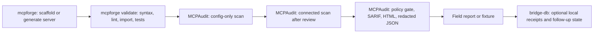

# MCP Trust Packet

This packet is the external story for the local MCP ecosystem:

1. Use `mcpforge` to create or scaffold an MCP server.
2. Use MCPAudit to inspect the trust boundary before a user connects it.
3. Convert real-world audit output into redacted field reports and regression fixtures.
4. Use `bridge-db` only as local operating-state infrastructure, not as part of the public
   product claim.

The point is not to say that generated MCP servers are automatically safe. The point is to make
the review loop concrete: generated, validated, audited, redacted, and turned into durable evidence.

## Public Roles

| Project | Public role | Strong claim | Boundary |
|---|---|---|---|
| MCPAudit | Trust and security review for MCP configs and servers | Local-first audit reports, JSON/SARIF/HTML output, policy gates, drift checks, redacted field reports | Do not claim beta until external redacted reports land |
| mcpforge | MCP server builder and scaffold generator | FastMCP projects with validation, inspection, doctor checks, tests, and safe defaults | Do not claim provider-neutral production generation while provider smokes are gated or blocked |
| bridge-db | Local operating-state bridge | Dogfood proof that MCP is used heavily in real multi-agent operations | Do not market as a general memory store or external product bundle |

## Local Workflow

Locally, the three projects fit together as a loop:



Use `bridge-db` for local receipts such as "field report requested", "fixture converted", or
"external follow-up complete". Keep the public packet focused on the artifacts another user can run:
commands, generated server files, MCPAudit reports, and issue/fixture links.

## Safe Baseline Demo

This demo uses the no-LLM scaffold path so anyone can reproduce it without API keys.
It has been smoke-checked with `fastmcp-builder==0.3.0` and
`mcp-permission-audit==1.13.1`.

```bash
tmpdir="$(mktemp -d)"

uvx --from fastmcp-builder==0.3.0 mcpforge init trust-packet-demo \
  --transport stdio \
  --output "$tmpdir/trust-packet-demo"

uvx --from fastmcp-builder==0.3.0 mcpforge validate \
  "$tmpdir/trust-packet-demo" \
  --json

uvx --from mcp-permission-audit==1.13.1 mcp-audit scan \
  --config "$tmpdir/trust-packet-demo/config.json" \
  --config-only \
  --skip-connect \
  --json "$tmpdir/mcp-audit-config.json" \
  --sarif "$tmpdir/mcp-audit-config.sarif" \
  --html "$tmpdir/mcp-audit-config.html" \
  --redact
```

Expected shape:

- `mcpforge validate` reports structural validity, import success, and passing generated tests.
- MCPAudit discovers one server from the generated config.
- `--skip-connect` keeps the scan config-only: no server is spawned and no endpoint is contacted.
- `--redact` aliases the server name in file artifacts, such as `server-01`.
- For a stdio scaffold, there should be no remote-endpoint config-health warning.
- The generated JSON, SARIF, and HTML report files should all be written.

This is the cleanest first demo because it proves the handoff between generator and auditor without
requiring hosted model access.

## Useful Warning Variant

`mcpforge init` defaults to `streamable-http`. If you omit `--transport stdio`, MCPAudit should flag
the generated HTTP config as a remote endpoint during a config-only scan:

```bash
uvx --from fastmcp-builder==0.3.0 mcpforge init trust-packet-http \
  --output "$tmpdir/trust-packet-http"

uvx --from mcp-permission-audit==1.13.1 mcp-audit scan \
  --config "$tmpdir/trust-packet-http/config.json" \
  --config-only \
  --skip-connect \
  --json "$tmpdir/mcp-audit-http.json" \
  --redact
```

That warning is useful, not embarrassing. In JSON output, it appears as a top-level
`remote_endpoint` config-health finding with the server name redacted to a stable alias such as
`server-01`. It demonstrates that MCPAudit separates a local stdio review path from an HTTP/remote
endpoint review path before the user connects anything.

## Richer Generated-Server Demo

Use the hosted mcpforge path only when provider access is healthy.

```bash
export ANTHROPIC_API_KEY="..."

uvx --from fastmcp-builder==0.3.0 mcpforge generate \
  "A read-only MCP server that summarizes a local CSV file" \
  --transport stdio \
  --yes \
  --output "$tmpdir/csv-summary-server"

uvx --from fastmcp-builder==0.3.0 mcpforge validate "$tmpdir/csv-summary-server" --json

uvx --from mcp-permission-audit==1.13.1 mcp-audit scan \
  --config "$tmpdir/csv-summary-server/config.json" \
  --config-only \
  --skip-connect \
  --json "$tmpdir/csv-summary-audit.json" \
  --redact
```

Do not use this path as the main public proof while provider matrix checks are blocked or gated. The
safe baseline demo above is enough to show the shape of the trust loop.

## Evidence Bundle

A complete public packet should include:

- the generated server README and config snippet;
- `mcpforge validate --json` output;
- MCPAudit config-only JSON/SARIF/HTML output produced with `--redact`;
- a short note naming which scan path was used: config-only, connected, pin-check, policy-gated, or
  artifact-verification;
- the smallest redacted fixture or report shape that can become regression coverage;
- if applicable, a GitHub issue link for the field report and a note granting fixture permission.

Do not include:

- credential values;
- private usernames or private file paths;
- internal hostnames, private URLs, customer names, workspace names, or proprietary tool/prompt/schema text;
- raw bridge-db state, local handoffs, or personal operating notes.

## Field-Report Path

The external credibility step remains MCPAudit field evidence:

```bash
python3 -m pip install --upgrade mcp-permission-audit
mcp-audit --version
mcp-audit scan --skip-connect --json mcp-audit-field-report.json --redact
```

Then open a redacted field-report issue:
<https://github.com/saagpatel/MCPAudit/issues/new?template=field_report.md>

Two accepted external redacted reports are still the beta bar. Solo demos, generated fixtures, and
bridge-db dogfood improve confidence, but they do not replace external evidence.

## Strongest Wedge

Lead externally with MCPAudit:

> Before you connect an MCP server to your agent, produce a local, redacted trust report that shows
> what the server can access, what changed, and which review gate it passed.

mcpforge makes the demo concrete. bridge-db makes the local operating story believable. MCPAudit is
the product wedge.
