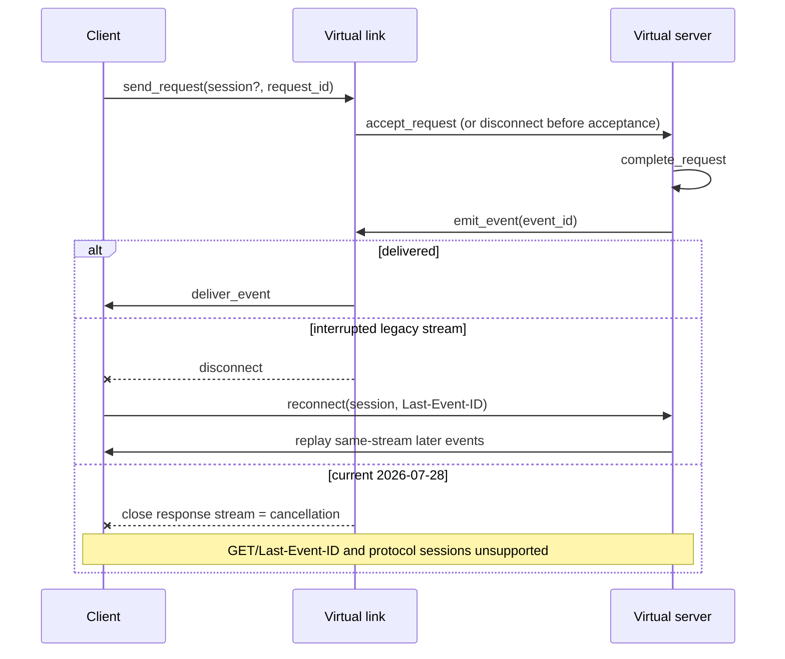

# MCP Session Resume Fault Lab

`mcp-audit session-resume` is an offline, deterministic laboratory for MCP
Streamable HTTP transport-session and resumability faults. It replays synthetic
client, server, and link transitions against a virtual clock. It never opens a
socket, contacts an MCP server, reads credentials, or imports a private
transcript.

## Specification profile and primary-source matrix

This matrix was refreshed **2026-08-11** from official primary sources. The
published MCP version is part of every scenario because the current protocol is
materially different from the legacy session-bearing revisions.

| Surface | 2025-03-26 / 2025-06-18 | 2025-11-25 | 2026-07-28 | Lab treatment |
|---|---|---|---|---|
| Protocol session | Server **MAY** return `Mcp-Session-Id` on initialization; subsequent requests **MUST** carry it when assigned. A server requiring it **SHOULD** return 400 when absent. | Same semantics; spelling is standardized as `MCP-Session-Id`, secure handling guidance is added. | Initialization and protocol-level sessions are removed. | Legacy profiles model optional/required sessions. The current profile reports session use as unsupported. |
| Session termination | Server **MAY** terminate at any time; a later request with that ID **MUST** receive 404. Client then **MUST** initialize a new session. Client **SHOULD** use DELETE; server **MAY** return 405. | Same. | No protocol session to terminate. | Expiry, server termination, client deletion, unknown IDs, and reuse are distinct transitions. |
| SSE event IDs | Server **MAY** attach `id`; when present it **MUST** be globally unique within the session/client and cannot be replayed across a different stream. | Adds that IDs **SHOULD** encode enough stream identity to correlate `Last-Event-ID`. | Request-scoped SSE remains, but resumable SSE via `Last-Event-ID` is not supported. | Event identity is explicit, bounded, and stream/request-bound in the virtual state. |
| Resume and replay | Client **SHOULD** reconnect with GET and `Last-Event-ID`; server **MAY** replay later events from that same stream. | Same; a server **SHOULD** prime a stream with an ID, can close/poll it, and can send an SSE `retry` value that the client **MUST** respect. | GET stream endpoint removed; no `Last-Event-ID` resume. | Legacy replay is `supported`, `unsupported`, or `implementation_defined`; current-profile reconnects fail visibly. |
| Disconnect and cancellation | Disconnect **SHOULD NOT** mean cancellation; client **SHOULD** send `CancelledNotification`. | Same. | Closing the request SSE stream **MUST** cancel that request; no Streamable HTTP `notifications/cancelled` is expected. | Cancellation is version-correct and cancellation-after-disconnect stays `UNKNOWN` without authoritative server evidence. |
| Protocol version | From 2025-06-18, subsequent HTTP requests **MUST** carry the negotiated `MCP-Protocol-Version`. Missing version can be treated as 2025-03-26 for compatibility; invalid/unsupported is 400. | Same. | Every POST **MUST** carry the header and matching body `_meta`; mismatch or unsupported version is 400 with a protocol error. Older-client compatibility can still treat an omitted header as 2025-03-26. | `protocol_version` selects a closed behavior profile; profiles are never silently blended. |
| Relevant HTTP status | Accepted notifications use 202 with no body; missing required session is recommended 400; terminated session is required 404; unsupported GET/DELETE can be 405. | Same, including 400/404/405 fallback probes for legacy HTTP+SSE. | Accepted notifications use 202; malformed/header/version failures use 400; unknown RPC method uses 404; invalid Origin uses 403. | Status is recorded as a transport observation, never as proof that an operation completed. |

Primary MCP snapshots:

- [Streamable HTTP 2026-07-28](https://github.com/modelcontextprotocol/modelcontextprotocol/blob/0cb6c6a31768cbb16129b35e6b569a31fecfe1b6/docs/specification/2026-07-28/basic/transports/streamable-http.mdx), repository path last touched by commit `0cb6c6a31768cbb16129b35e6b569a31fecfe1b6` on 2026-07-28.
- [Transports 2025-11-25](https://modelcontextprotocol.io/specification/2025-11-25/basic/transports), historical repository path last touched by commit `977e7481985c7e87e218ad037ea6ff5e383b8cfe` as of this review.
- [Transports 2025-06-18](https://modelcontextprotocol.io/specification/2025-06-18/basic/transports), historical repository path last touched by commit `0a736f347d4a6cebe6eba1d9088fe3f5516dbc37` as of this review.
- [Streamable HTTP 2025-03-26](https://github.com/modelcontextprotocol/modelcontextprotocol/blob/main/docs/specification/2025-03-26/basic/transports.mdx).
- [WHATWG Server-Sent Events](https://html.spec.whatwg.org/multipage/server-sent-events.html), living standard retrieved 2026-08-11. It defines `id`, retained last-event ID, `Last-Event-ID`, and `retry` processing; it does not define MCP replay retention.
- [RFC 9110 HTTP Semantics](https://www.rfc-editor.org/rfc/rfc9110.html), especially 202, 400, 404, 405, 408, and 503. HTTP 202 is intentionally noncommittal and does not prove processing completed.

### Implementation-defined and unspecified gaps

The lab records these as modeled assumptions instead of standards claims. In
the inspected session/resume surfaces, MCP does not fully prescribe:

- whether a legacy server assigns a session at all, or requires one when it does;
- the concrete session-ID format beyond visible ASCII, uniqueness, and security guidance;
- session lifetime, idle expiry, early termination policy, or DELETE support;
- whether a legacy server implements replay, how long it retains events, or how it reports a replay gap;
- handling for stale, malformed, never-issued, or cross-instance `Last-Event-ID` values;
- event-ID encoding, durable storage, acknowledgement, compaction, or survival across restart;
- session/replay behavior across process restart, load-balancer migration, failover, or region movement;
- session-ID rotation and any old-to-new migration mapping;
- arbitration and ownership when reconnects race concurrently;
- result deduplication after replay, client receipt acknowledgement, and replay-consumption idempotency;
- request idempotency or an authoritative status query after ambiguous delivery;
- whether work crossed the acceptance boundary when the link fails before observable acceptance;
- whether an accepted operation completed when the response is lost;
- a universal client backoff ceiling beyond an emitted SSE `retry` value;
- application compensation when cancellation races completion; or
- any exactly-once guarantee. An idempotency token mechanism was explicitly
  outside the legacy transport proposal, and the published transport never
  supplies the invariants required for an exactly-once claim.

## Contracts

The CLI emits authoritative JSON Schemas from strict Pydantic contracts:

```bash
uv run mcp-audit session-resume schema scenario
uv run mcp-audit session-resume schema transcript
uv run mcp-audit session-resume schema report
uv run mcp-audit session-resume schema suite-report
```

Contract identifiers are:

- `mcpaudit.session-resume.scenario.v1`
- `mcpaudit.session-resume.transcript.v1`
- `mcpaudit.session-resume.report.v1`
- `mcpaudit.session-resume.suite-report.v1`

Scenario input is bounded to 1 MiB, 32 JSON levels, 256 ordered steps, and 32
reconnect attempts. Unknown fields, scalar coercion, duplicate JSON keys,
duplicate step identities, decreasing logical times, symlinks, non-regular
files, raced file identities, unsupported step shapes, and excessive input are
rejected with exit `2`.

Every step declares `at_ms`; array order breaks ties, so concurrent logical-time
events still have one exact transcript order. Reports contain no wall-clock
timestamp, host path, random value, credential, or network-derived data.
Scenario session IDs are treated as bearer-like and appear only as deterministic
report-local `session-ref-NNN` pseudonyms. Each
scenario carries assumption provenance classified as:

- `standard_requirement` — text directly modeled from a pinned primary source;
- `design_inference` — a conservative conclusion where the standard is silent;
- `fixture_behavior` — behavior chosen only by the synthetic scenario.

## State model



The implementation is transport-neutral: steps represent client/server/link
effects without an HTTP client or server implementation. A later adapter can
project recorded HTTP observations into this contract, but live networking is
deliberately absent.

## Safety classification

Each report independently classifies:

- `at_most_once`: supported, contradicted, or unknown from modeled accept/delivery counts;
- `at_least_once`: supported, contradicted, or unknown from modeled completion evidence;
- `duplicate_risk`: observed, not observed, or unknown, counted per request
  even when duplicate results use distinct event IDs;
- `lost_result_risk`: observed, not observed, or unknown, correlated per
  request so unrelated duplicate deliveries cannot offset a missing result; and
- `unknown`: included whenever a required acceptance, completion, deduplication, replay, or cancellation fact is unavailable.

Seeing both at-most-once and at-least-once in one complete local trace does not
prove exactly-once. Every report fixes the claim ceiling to
`local_model_observations_only_exactly_once_unproven`.

Stable finding IDs are:

| Rule | Surface |
|---|---|
| `MCPSR000` | insufficient or ambiguous transition evidence |
| `MCPSR001` | protocol-version/session-resume incompatibility |
| `MCPSR002` | missing required session ID |
| `MCPSR003` | unknown, expired, terminated, or lost session |
| `MCPSR004` | stale/unknown cursor or replay gap |
| `MCPSR005` | duplicate acceptance or event delivery risk |
| `MCPSR006` | completed or accepted work without a delivered result |
| `MCPSR007` | concurrent reconnect or retry-bound failure |
| `MCPSR008` | cancellation ambiguity after disconnect |
| `MCPSR009` | restart, migration, or rotation assumption gap |

## Five-minute demo

```bash
# 1. Confirm the packaged corpus (18 faults/controls, no server required).
uv run mcp-audit session-resume list

# 2. Read one actionable failure report.
uv run mcp-audit session-resume run disconnect-after-acceptance-before-response

# 3. Obtain canonical JSON for CI or a diffable receipt.
uv run mcp-audit session-resume run replay-gap --format json

# 4. Replay the entire corpus in one deterministic report.
uv run mcp-audit session-resume run --all --format json > /tmp/mcpaudit-session-resume.json

# 5. Supply your own strict v1 JSON scenario.
uv run mcp-audit session-resume run ./scenario.json --format json
```

Valid executions exit `0` even when a fault is observed; faults are the product
output, not command failures. Invalid selection or malformed input exits `2`.

## Claim ceiling and scope boundary

The lab proves only deterministic behavior of the supplied synthetic scenario
under its declared assumptions. It does not prove live MCP interoperability,
SDK behavior, network delivery, server persistence, adoption, authorization,
cryptographic identity, task lifecycle, result-payload semantics, production
safety, or exactly-once execution. P01 owns task lifecycle simulation; P03 owns
result-parcel analysis. This lab owns only transport sessions, interruption,
resumption, replay, and their observable safety consequences.
