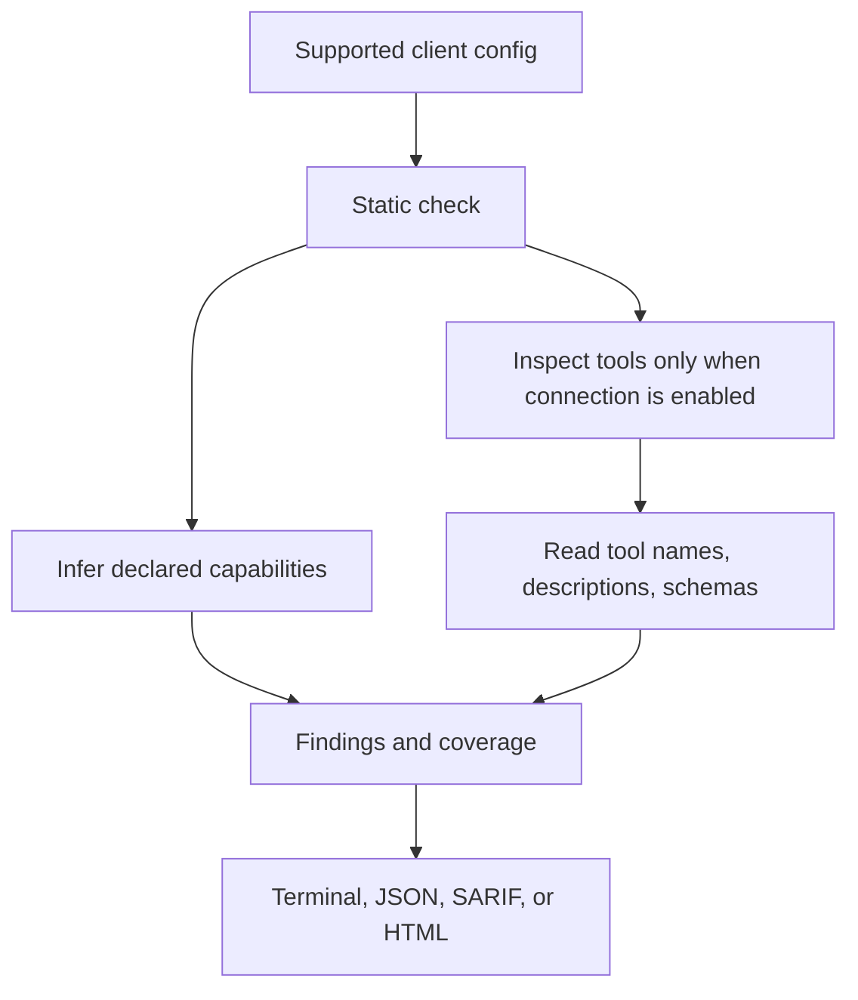

# How MCPAudit works

MCPAudit has separate static review and connected inspection paths. The command
you choose determines whether configured MCP servers are started or contacted.

## Static check

`mcp-audit` runs `check`. It reads supported configuration candidates and
infers possible capabilities from declared commands, arguments, environment
variable key names, and endpoints. Use `--config FILE` to select one explicit
file; that excludes discovery unless `--include-discovered` is requested.
`inspect` lists discovered identities and source status without connecting.

`demo` uses the bundled synthetic sandbox configuration and does not perform
workstation discovery. The static pass does not start MCP servers. It can show
only what the configuration and available static evidence support.

## Connected inspection

`check --connect --server CLIENT:SCOPE:NAME` requires one unambiguous identity.
It may start a local process or contact a configured endpoint to list server
capabilities. Legacy `scan` retains its separate behavior and defaults. Starting
a server is not the same as calling its tools; the opt-in canary is a distinct
operation that may make bounded empty-argument calls when eligible.

Package verification and artifact downloads contact registries only when their
specific options are requested. LLM analysis is also opt-in. Review command
help and the relevant guides before enabling these operations.

## Outputs and limits

The report combines findings with coverage information, including checks that
were skipped or incomplete. JSON fields and SARIF identifiers are described in
the [output contract](OUTPUT-CONTRACT.md). Findings are heuristics or bounded
observations, not proof that a server is benign or malicious. A clean static
check does not establish runtime behavior.

## Listing size limits

Connected stdio listings reject frames larger than 16 MiB before JSON parsing.
`scan` and `check` accept `--max-frame-bytes` and `--max-surface-bytes` (64 MiB
across listing pages and surfaces). Retained item text is capped at 256 KiB;
`surface_truncated` warns that metadata is incomplete. The temporary
`--sdk-stdio-fallback` flag uses the SDK reader for compatibility and disables
the frame cap; it retains the listing caps. See the [output contract](OUTPUT-CONTRACT.md).
