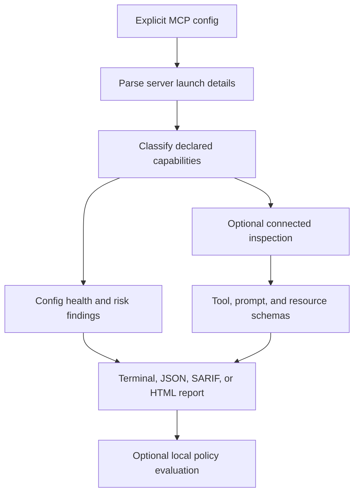

# How it works

MCPAudit has a config-only path and an optional connected path. Config-only
analysis reads the config supplied with `--config` and infers declared
capabilities. A connected scan starts configured local processes or contacts
configured endpoints to inspect live tool, prompt, and resource schemas.

Use `--config FILE --config-only --skip-connect --override-config /dev/null`
to limit the command to one supplied file and avoid reading a user override
file. Do not omit the explicit config when you want to avoid automatic config
discovery.

The report describes observable configuration and schema evidence. It does
not prove how a server behaves after the scan, what a remote package will do
later, or whether a declared capability is exploitable. See [Reading
results](reading-results.md) for the finding and warning boundaries.
